# 分布式系统复习大纲

> Author：胡子昂  
>
> Date：2018年6月4日 星期一 下午7:06

## Chap 2 并行编程平台

### 2.1 处理器内并行

- 微处理器体系结构发展：

  1. 流水线（pipeline）：等同于操作系统流水线。

  2. 超标量执行：有多个流水线，同时执行多条相同流水线阶段的指令。

     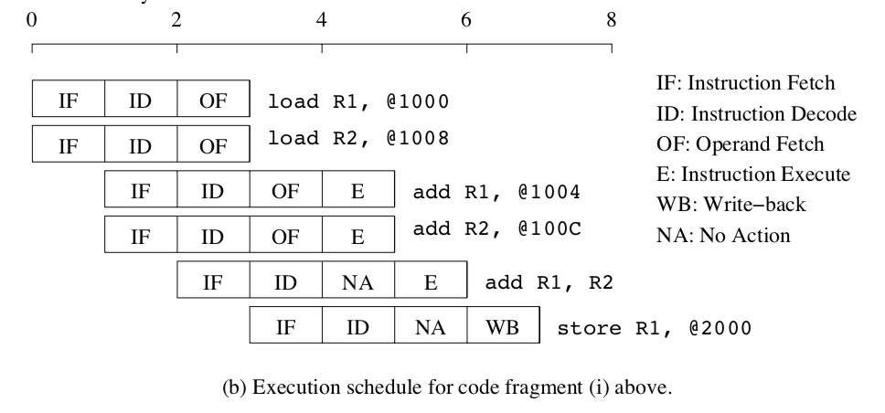

###2.2 内存系统性能的极限

- 延迟：内存收到一条内存字请求，在lus的延迟后，返回数据。则延迟为lus。
- 带宽：程序每秒钟通过请求内存可获得的最大字节数。
- 躲避延迟方法：
  1. 预取：预先取更多的数据。
  2. 多线程：一个线程等待时切换到另一个线程。

### 2.3 并行计算平台剖析

- 并行计算平台控制结构：

  - SIMD和MIMD：

    SIMD是单指令多数据流，只有一个控制单元，该控制单元将单个指令交给不同处理器执行，**机器内部需要进行同步**。（并行算法主要研究SIMD）

    MIMD是多指令多数据流，每个处理器有一个控制单元，每个控制单元将指令交给对应的处理器执行，**机器内部不需要进行同步**。

    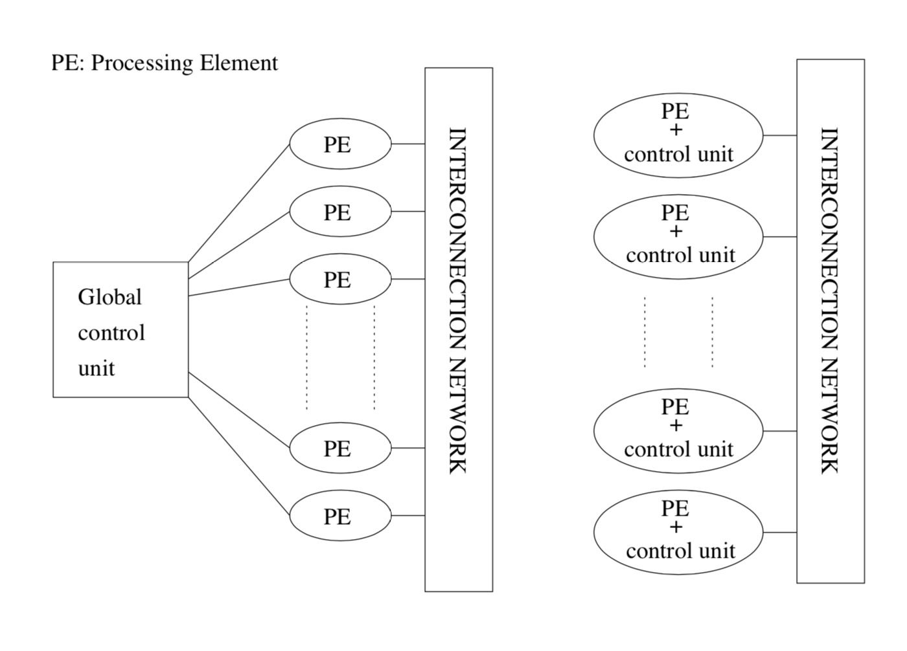

- 并行计算平台通讯模型：

  - SIMD通信模型：共享地址空间平台（PRAM，即共享内存机器）和消息传递平台。

    共享内存一般用于单一计算机内通讯。

    消息传递一般用于计算机之间通过网络通讯。

### 2.4 并行平台的物理组织

- 并行平台物理组织：

  - PRAM的四小类：
    1. EREW：串行读，串行写。
    2. CREW：并行读，串行写。
    3. ERCW：串行读，并行写。
    4. CRCW：并行读，并行写。
  - CRCW（仅限于CW）的四种协议：
    1. 共有：如果处理器写的值相同，则写入。
    2. 任意：当一个处理器写时，其他不能写。（等同于EW）
    3. 优先级：处理器按优先级排序，最高优先级的写，其他不能写。（有优先的EW）
    4. 求和：所有量的总和被写入。类似于O(1)的规约。

- 网络拓扑结构：

  1. 基于总线：所有处理器通过总线进行通讯和访问内存。

     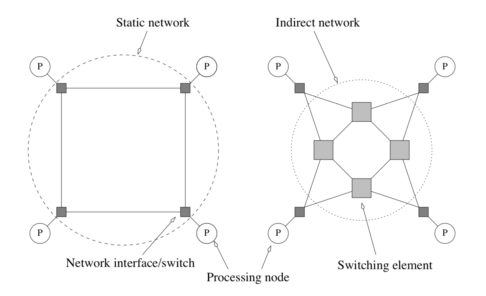

  2. 交叉开关网络：n个处理器和m个内存存储地址，用一个n*m矩阵S访问。例如：当S\[i\]\[j\]打开时，代表第i个处理器正在访问第j个内存储存地址。

     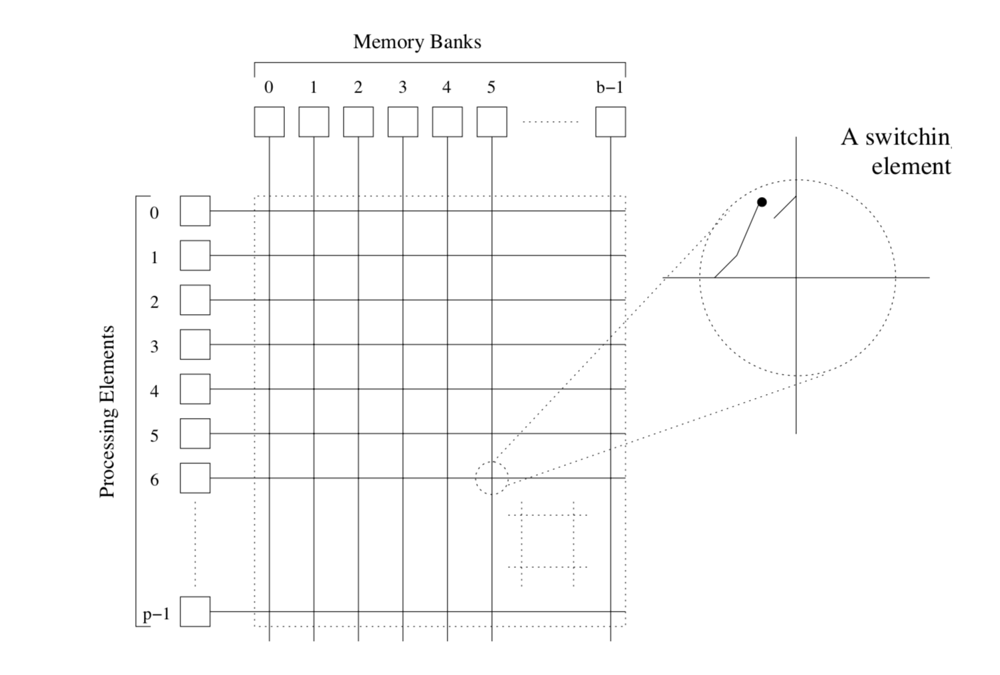

  3. 多级网络：多级网络的每个节点开和关代表两种连接，一种是直通式(a)，一种是跨接式(b)。

     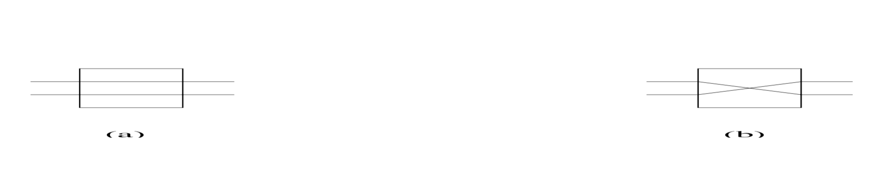

     多级网络的一种连接例子：omega网络。

     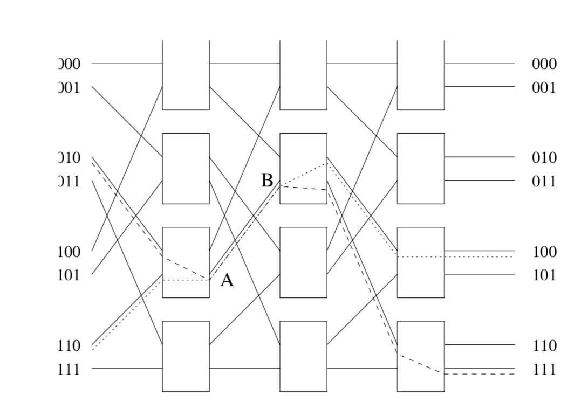

     通过切换每个节点的开关，可以将左边8个节点（代表处理器）通过不同方式映射到右边八个节点上（内存）。

     Q：如何通过控制开关将左边节点映射到右边节点？例如如何控制节点将S(010)映射到T(111)。

     A：先求出s⊕t = 101，1代表交叉，0代表平行。因此s->t途径的三个节点分别是交叉平行交叉(101)。

  4. 全连接网络和星型网络：太简单了，略。

  5. 线性网络：连一条线，分为有环和无环。

  6. 2维格网：2维线性网络，分为有环和无环。

  7. k-d格网：有d维，每一维有k个节点。其中，个数为p的线性网络是1-p格网或者p-1格网。

  8. 超立方体：看图，和计算机类似的一种多级网络。

     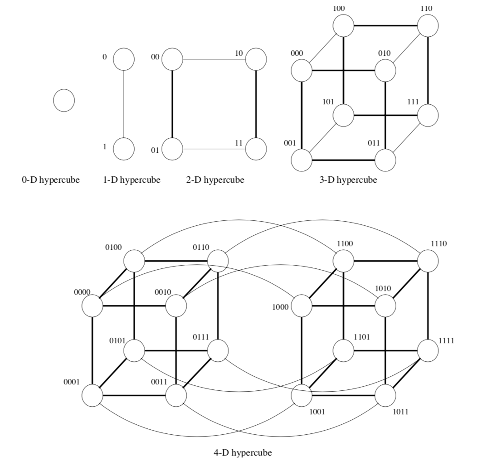

  9. 树网络：同数据结构的树，可分为静态树，动态树，胖树。

     静态树：非叶节点是处理器。

     动态树：非叶节点是开关节点。

     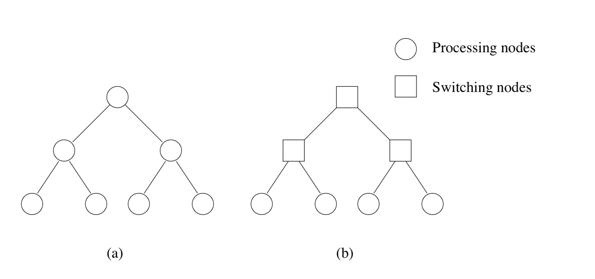

     胖树：在动态树的基础上，树层级越高边数越高。

     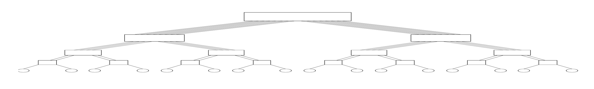

- 静态互联网络评价：

  - 评价参数：

    - 直径：网络任意两个节点之前的最长距离。
    - 弧连通性：等同于找出网络中任意一个节点，该节点的边数量最小，这个值就是连通性值。
    - 对分宽度：如果要将网络等分，最少需要切多少条边。
    - 成本：网络中总共有多少条边。

  - 评价图：

    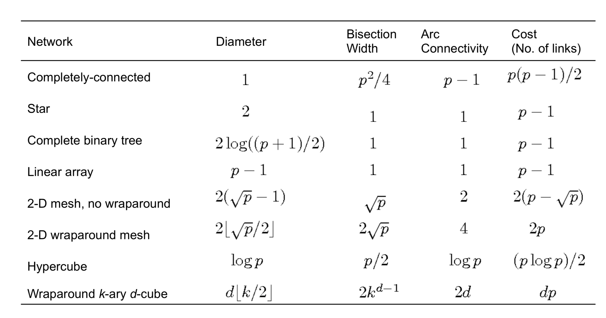

- 动态互联网络评价：

  - 评价参数：除成本都一样。

    - 成本：网络中总共有多少个开关。

  - 评价图：

    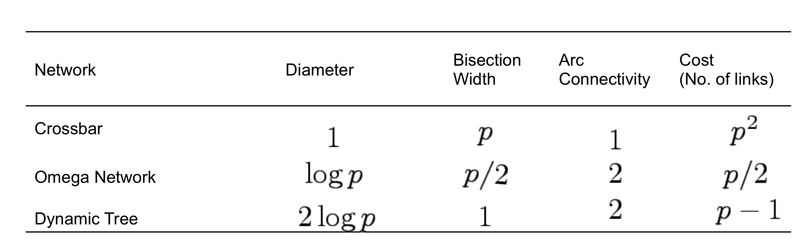

### 2.5 并行计算机的通信成本

- 并行计算机的消息传递成本：

  - 评价参数：

    - 启动时间$t_s$：发送节点和接受节点处理消息所花的时间，一条消息只有一次。
    - 每站时间$t_h$：消息在节点之间传输时间。（**非常小，基本没用过**）
    - 每字传输时间$t_w$：节点接收一个字节所花的时间。

  - 存储转发（store-forward）时间：（l条链路边，数据大小为m）

    $t_{comm} = t_s + mlt_w$

    （PS：$t_h$忽略。）

  - 直通路由（cut-through）时间：（l条链路边，数据大小为m）

    $t_{comm}=  t_s + mt_w$

    （PS：$t_h$忽略。）

## Chap 3 并行算法设计原则（感觉没什么重要的）

### 3.1 

- 分解：把一个计算分解成多个小部分，其中的一些或全部部分可以并行执行。
- 任务：程序员定义的计算单元，分解出的每一部分都可称为一个任务。
- 映射：将其中一个任务映射到其中一个进程上执行。

### 3.2

- 递归分解：将问题划分成子问题，子问题划分成更小的子问题。（例如：归并排序分解）
- 数据分解：将要处理数据划分成多个部分。其中包括：
  - 划分输入数据。
  - 划分输出数据。
  - 同时划分输入和输出数据。
  - 划分中间结果数据。

## Chap 4 基本通讯操作

**PS：基本通讯操作一般都是建立在cut-through上。store-forward则只用看直径即可。**

**PS2：有一种简单的判断T的方法。ts前面的参数是总共进行的步数，tw前面的参数是0节点（首节点）在这个过程中**

**的数据量总和**

**例如：对一对多广播环形陈列，假设有p个处理器，则步数为logp，首节点每步传递的数据固定为m，总共有logp次，则时间为：T = ts logp + tw m logp**

### 4.1 一对多广播和多对一规约

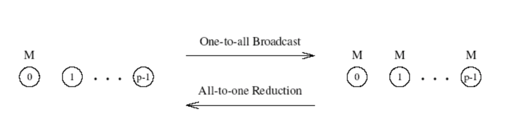

**PS：多对一规约就是一对多广播的逆方向**

**PS2：每一步需要的时间见2.5**

- 环形或线性陈列：假设有p个处理器，对收到数据的节点i，分别向i + p/2，i + p/4，i + p/8…传递数据直到所有数据传递完毕。总共需要logp步。

  广播和规约如下图：

  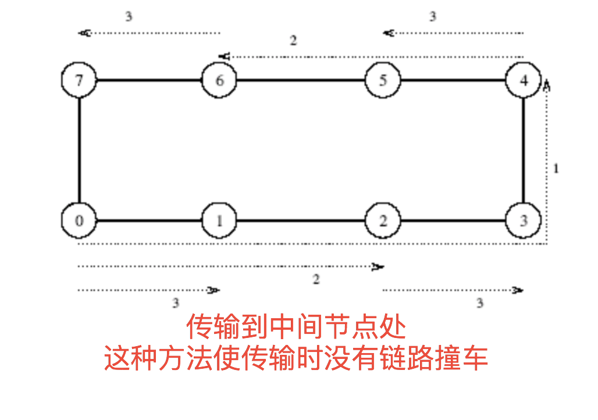

  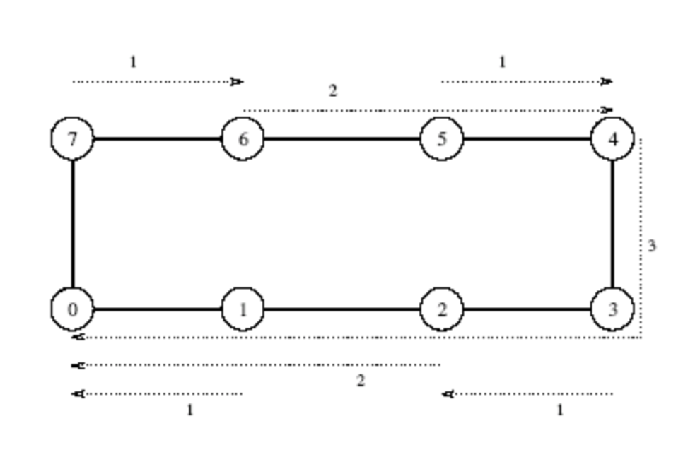

- 矩阵和向量乘法：n*n矩阵S和n\*1向量V的乘法，假设有n\*n个处理器。

  Step1：n个处理器将向量中的每个元素广播到矩阵中的相应列中，例如将V[i]广播到S的第i列中。

  Step2：每个处理器负责一个节点，进程乘法计算。

  Step3：每行的n个处理器进行规约，规约到一个处理器中，得到n*1结果向量。

  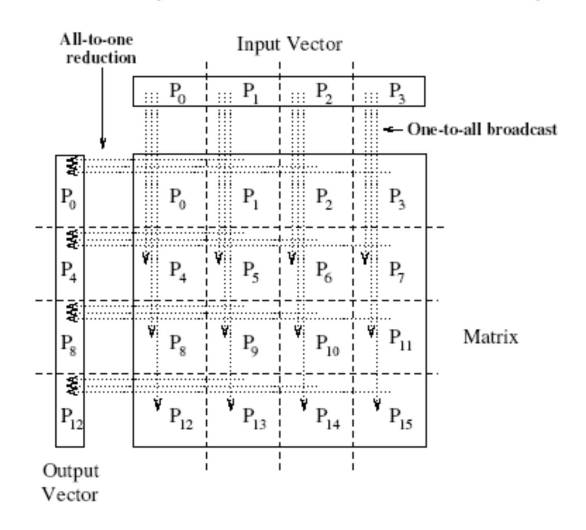

- 格网：横着来一次线性广播，接着竖着来一次线性广播。假设有p个处理器，则总共需要2log√p步，即logp步。

- 超立方体：看作n维格网，由于每增加一维增加相同节点数，因此每传递一维需要一步。假设有p个处理器，则总共需要logp步，即维数。

- 平衡二叉树：做法等同于线性陈列广播。

- 总结：无论哪种情况，广播和规约的时间都为：$T = t_s\log p + t_wm\log p$

###4.2 多对多广播和规约 

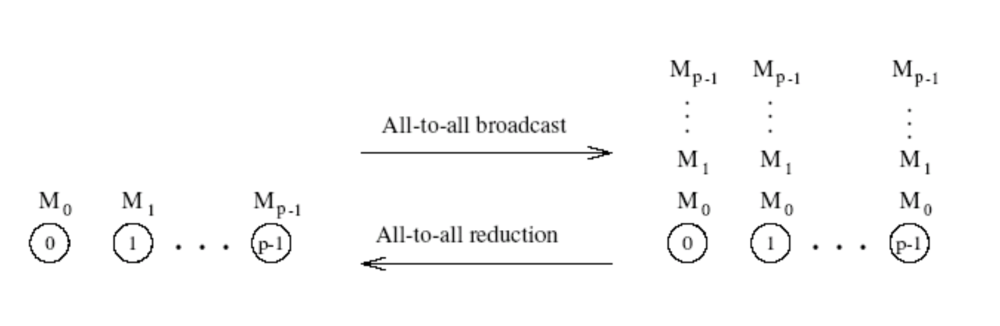

**PS：多对多规约与其说是多对多广播的逆方向，不如说是在多对多广播传递数据的基础上，加上数据处理（求和之类的）**

- 环形或线性陈列：假设有p个处理器。

  Step1：将自己的数据传递给下一个节点。

  Step2 -> (p-1)：收到上个节点传递过来的数据后，储存该数据，同时把该数据传递给下一个节点。

  通过p-1步后，每个节点都有所有的数据了。

  由于每次只需要传递m大小的数据，因此所花时间为：$T = t_s(p - 1) + t_wm (p - 1)​$

  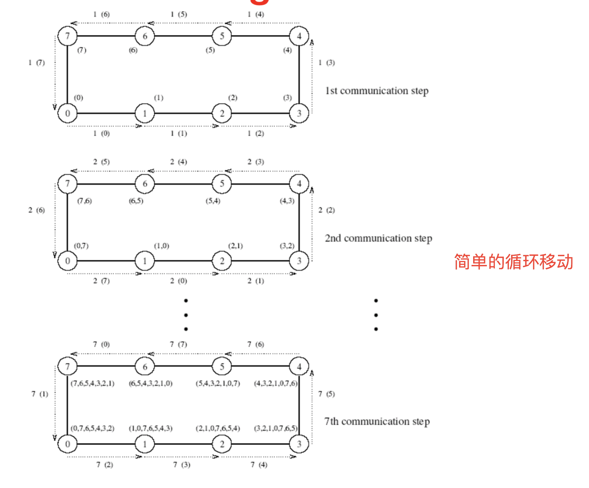

- 格网：横着来一次线性广播，接着竖着来一次线性广播。假设有p个处理器，则总共需要2(√p - 1)步。

  第一次广播传递的数据量为m，通信时间为$T_1 = (t_s + t_wm) (\sqrt p - 1)​$。

  第二次广播传递的数据量为√pm，通信时间为$T_2 = (t_s + t_w\sqrt pm) (\sqrt p - 1)​$。

  两个时间加到一起，总时间为：$T = T_1 + T_2 = 2t_s(\sqrt p - 1) + t_wm(p - 1)$

- 超立方体：与一对多广播相同，区别是每次节点发送的数据加倍。假设有p个处理器，则总共需要logp步，即维数。

  在第i步中，交换信息的长度为$2^{i - 1}m$，花费的时间为$t_s + 2 ^{i - 1}mt_w$。

  将所有时间相加（等比数列求和），总时间为：$T = t_s \log p + t_wm(p - 1)$

  **三者tw相同（废话），ts根据通讯结构不同。**

### 4.3 前缀和（感觉没什么重要的）

- 每个节点求前缀和的时候，根据自己的节点数选择是否加接收到的数据。

  例如：当节点3(011)在计算前缀和的时候，加第一次(2)和第二次(0 + 1)接收到的数据，最后加上自己即可。

### 4.4 散发和收集

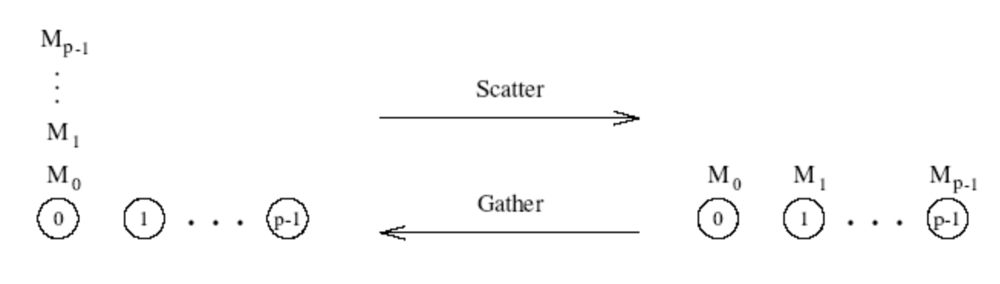

**PS：散发发送不同的数据，广播发送相同的数据。**

散发方法类似于一对多广播，区别是每次发送的数据不同（减半）

总共时间（三种结构相同）：$T = t_s \log p + t_wm(p - 1)$

### 4.5 多对多私自通讯

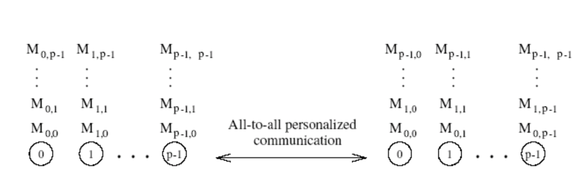

**PS：每个节点都同时进行散发**

- 环形或线形陈列：假设有p个处理器。

  Step1：将自己想发送给其他人的数据(p-1个)传递给下一个节点。

  Step2 -> (p-1)：收到上个节点传递的数据集合后，取出属于自己的数据，同时把剩下的数据传递给下一个节点。

  通过p-1步后，每个节点都有所有的数据了。

  由于每步需要传递的数据从(p-1)m依次减m直到0，因此所花时间为：$T = t_s (p -1) + t_w m \frac{p(p - 1)}{2}​$

- 网格：横着来一次线性广播，接着竖着来一次线性广播。假设有p个处理器，则总共需要2(√p - 1)步。

  第一次广播传递的数据量从(p - √p)m依次减√pm直到0，因此所花时间为：$T_1 = t_s (√p -1) + t_w m \frac{ p(√p - 1)}{2}​$

  第二次广播传递的数据量和第一次一样，因此所花时间和第一次相同。

  两个时间加到一起，总时间为：$T = 2T_1 = 2 t_s (√p -1) + t_w m p(√p - 1)$

- 超立方体：每次向一个方向传递数据，传递的数据包含另一面的所有数据。

  以3维为例：

  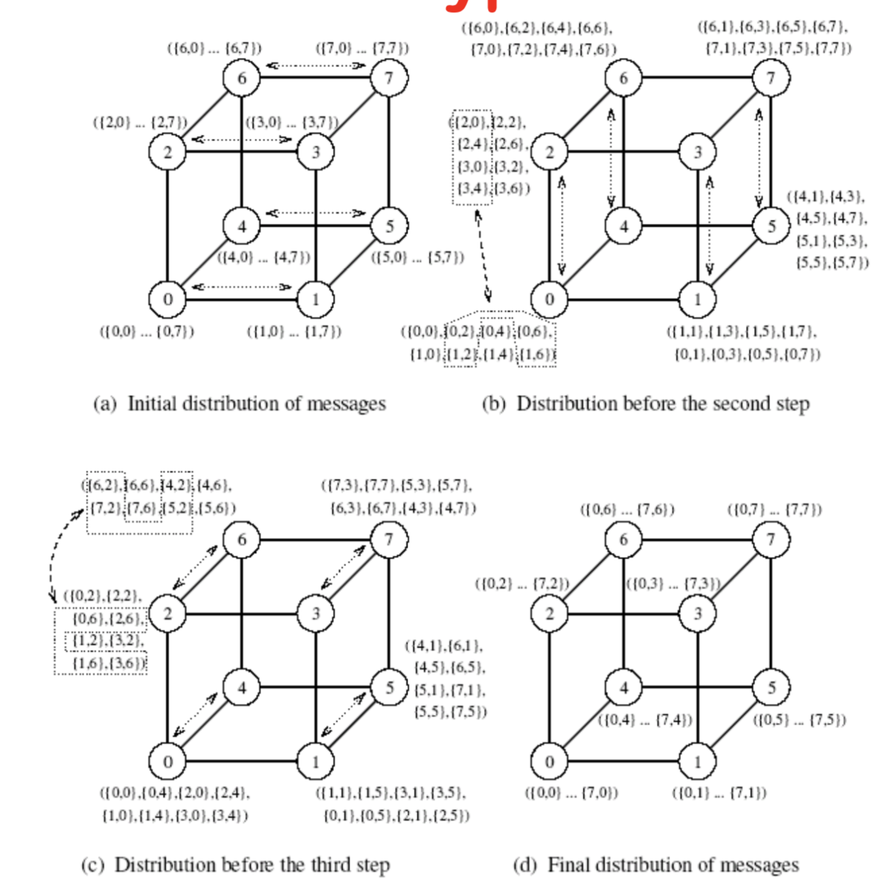
  Step1：0和1通讯。0传递给1最终传递到(1, 3, 5, 7)四个节点之一的数据，共四个。

  Step2：0和2通讯。0传递给2最终传递到(2, 3, 6, 7)四个节点之一的数据，共四个。（由于3，7之前给过了，因此实际只有(2, 6)两个节点之一的数据）

  Step3：0和4通讯。0传递给2最终传递到(4, 5, 6, 7)四个节点之一的数据，共四个。（由于5，6，7之前给过了，因此实际只有4这个节点的数据）

  通讯结束。

  假设有p个处理器，则一共进行了logp步，每一步都传递了mp/2大小的数据，因此总时间为：$  T = t_s \log p + t_w \frac {m p log p}{2}$

- 最优算法：本节中，这种算法不是最优的，最优算法我没看懂，总时间为：$T = t_s(p - 1) + t_w m (p - 1)$

### 4.6 循环移位（也叫置换）

- 循环移位类似二进制左移右移。举例：可以将数组[1, 2, 3, 4, 5, 6]向右循环移两位得到数组[5, 6, 1, 2, 3, 4]。第一个数组代表处理器，第二个数组代表数据，1处理器处理5号数据，以此类推。

- 环形或线性陈列：正向或反向执行n次即可。

- 格网：以4*4格网循环移动5位（12->7）为例：先算出5需要行列各移动一次达到（5 mod 4 = 1，5 / 4 = 1）。接着进行移动。总共分三步：

  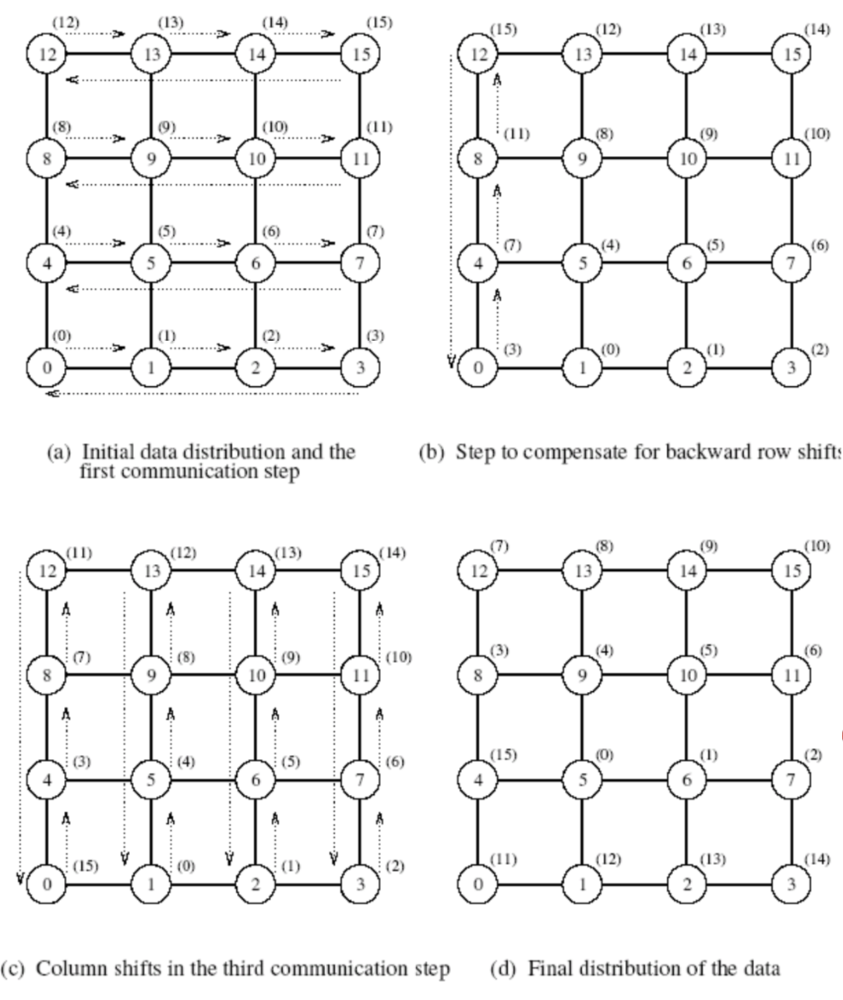

  Step1：行移动一次。

  Step2：第一步中反向移动的部分进行列移动一次。（第一步后，12应该对应11而不是15）

  Step3：列移动一次。

  通讯结束。

  假设由p个处理器，三个步骤中，步骤2必须进行一次移动，步骤1和步骤3最多进行性√p/2次移动（如果移动超过一半就反方向移动），因此总时间上界为：$T = t_s (\sqrt p + 1) + t_w (\sqrt p + 1)$

- 超立方体：将移动转换成二进制表示（5 -> 101），对每一位判断，如果是1，移动，如果是0，不移动。1移位操作可以在一步内完成，其他位移位操作可以在两步内完成（不晓得为什么，背吧）。

  由于移动超过一半就可以反方向移动，因此总时间上界为：$T = t_s  \log p + t_w \log p$

- 最优算法：和上一节一样，这种算法不是最优的，同上一节一样，这种算法我也没看懂，总时间为：$T = t_s + t_w m​$（一次搞定）

### 总结：

- 各类通讯方式的最快时间：

  |    通讯方式     |             最快时间             |
  | :-------------: | :------------------------------: |
  | 一对多广播/规约 |   $T = t_s\log p + t_wm\log p$   |
  |   多对多广播    |  $T = t_s \log p + t_wm(p - 1)$  |
  |   散发和收集    |  $T = t_s \log p + t_wm(p - 1)$  |
  | 多对多私自通讯  | $T = t_s(p - 1) + t_w m (p - 1)$ |
  |      置换       |        $T = t_s + t_w m$         |

##Chap 5 并行程序的解析建模

### 5.1 并行程序中的开销来源

- 开销有三个方面：
  1. 进程间通讯
  2. 空闲等待
  3. 额外等待：最优串行算法没办法并行化，只能用一个慢一点但容易并行化的算法。（情况较少）

### 5.2  并行系统的性能度量

- 执行时间$T$：程序开始到结束所花的时间。$T_s$表示串行执行时间，$T_p$表示并行执行时间。
- 开销函数$T_o$：代表并行系统的开销。$T_o = p T_p - T_s$（p为处理器数量）
- 加速比$S$：代表串行算法转换成并行算法时间复杂度的加速。$S = \frac{T_s(时间复杂度表示)}{T_p(时间复杂度表示)}$
- 效率$E$：处理器被充分利用的情况。$E = \frac{S}{p}$（E在0-1之间）
- 成本：执行并行算法时，处理器花费的时间总和。$T_{成本} = p T_p(时间复杂度表示)$
- 成本最优：当并行系统中，有$T_{成本} = T_{s}$ ，则该系统是成本最优的。（并且效率E是1）

###5.3  

- 可以通过减少处理器数量达到成本最优

### 5.4 并行系统的可扩展性

- 问题规模$W$：一个动态的数值，代表问题的大小，可以看成串行算法的时间复杂度。

- 当W不变时，p增加，E下降。

  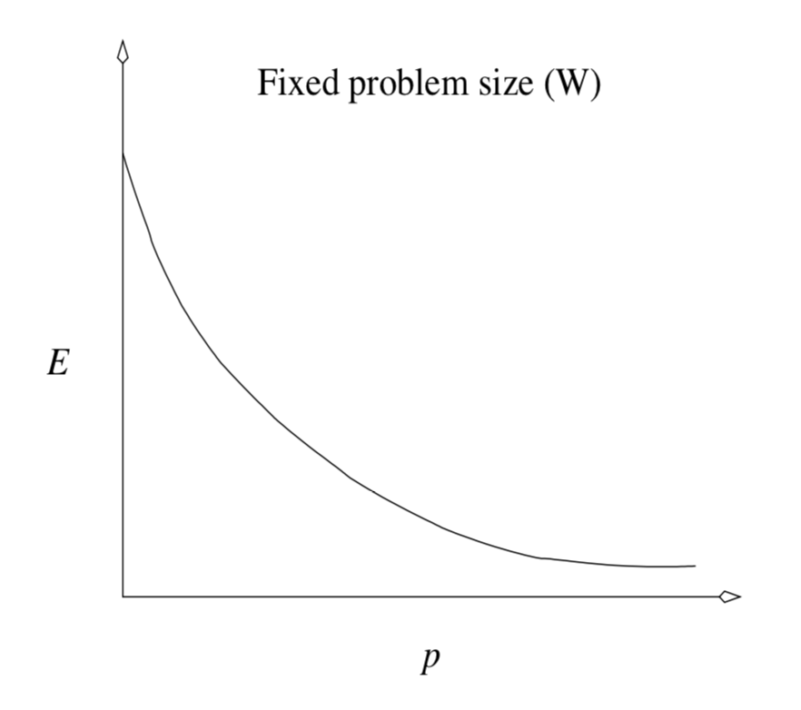

- 等效率函数：看不出来有什么用，以防万一还是写一写吧。

  根据$E = \frac{1}{1 + T_o(W, p)/W}$，可得$W = \frac{E}{1 - E}T_o(W, p) = KT_o(W, p)$，将各个参数全部带入，然后消除n，就得到等效率函数：$W = f(p)$

## Chap 8 稠密矩阵算法

**PS：此章所有广播，规约，置换等操作都是建立在最优的网络通讯结构上，详情请见第四章总结**

### 8.1 矩阵向量算法(n\*n x n\*1)

**PS：矩阵大小n\*n，向量大小n\*1，处理器数量p**

- 一维划分：

  - p = n：

    初始时每个处理器有矩阵的一行数据和向量的一个元素。分为两步：

    

    Step1：将向量元素多对多广播（每个进程都需要得到整个向量）。

    Step2：进行1\*n x n\*1向量乘法，得到结果。

  - p < n：（每个处理器处理n/√p*n大小的数据）

    第一步花费时间：$t_s \log p + t_w n$

    第二步花费时间：$n^2 / p$

    并行运算时间：$T_p = n^2 / p + t_s \log p + t_w n$，当$p = O(n)$时，成本最优。

    等效率函数：$W = \Omega(p^2)$

- 二维划分：

  - p = n^2：

    初始时每个处理器拥有矩阵的一个元素，其中前n个处理器个拥有向量的一个元素。分为四步：

    

    Step1：将向量元素传递到对角线处理器上。

    Step2：拥有向量元素的处理器将向量元素一对多广播。（只广播同列）

    Step3：进行乘法，得到结果。

    Step4：同行处理器进行多对一规约，得到结果。

  - p < n^2：（每个处理器处理n/√p*n/√p大小的数据）

    第一步花费时间：$t_s + t_w n/\sqrt p$（一对一传递）

    第二步花费时间：$t_s \log \sqrt p + t_w n/\sqrt p \log \sqrt p$（只是一对多广播，不是多对多广播）

    第三部花费时间：$n / \sqrt p * n / \sqrt p = n^2 / p$

    第四步花费时间：$t_s \log \sqrt p + t_w n/\sqrt p \log \sqrt p$

    并行运算时间：$T_p ≈ n^2 / p + t_s \log p + t_w \frac{n}{\sqrt p} \log p​$（第一步忽略），当$p = O(n^2/\log^2n)​$时，成本最优。

    等效率函数：$W = \Omega(p)$

### 8.2 矩阵乘法(n\*n x n\*n)

**PS：矩阵A和矩阵B的大小都是n\*n，处理器数量p**

- Cannon's Algorithm：（二维划分）

  - p = n^2：

    初始时每个处理器拥有A矩阵的一个元素和B矩阵的一个元素。分为(3 + n)步：

    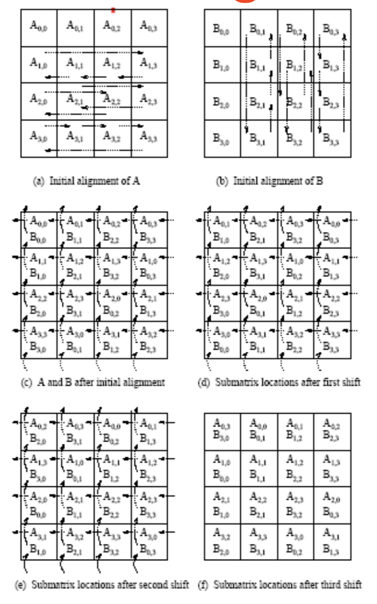

    Step1：将A矩阵的数据进行行移动，第i行的左移i位（i从0开始）。

    Step2：将B矩阵的数据进行列移动，第i列的上移i位（i从0开始）。

    Step3 -> 3 + n - 1：将处理器中A、B矩阵对应的元素相乘，得到结果。然后A矩阵左移一位，B矩阵上移一位，重复该步。

    Step(3 + n)：将3 -> 3 + n -1所得到的结果累加，即为最终结果。

  - p < n ^2：（每个处理器处理n/√p*n/√p大小的数据）

    第一步花费时间：$t_s + t_w n^2 / p$

    第二步花费时间：$t_s + t_w n^2 / p$

    第三阶段花费时间：（此处共√p次）$\sqrt p (n / \sqrt p)^3(矩阵乘法所花总时间) + 2 \sqrt p(t_s  + t_w n^2 / p) (两个矩阵移动总时间) = n^3 / p +  2t_s \sqrt p +2 t_w n^2 / \sqrt p$

    最后一步所花时间：这一步其实在上一阶段就可以直接完成。

    并行运算时间：$T ≈ n^3 / p +  2t_s \sqrt p +2 t_w n^2 / \sqrt p$，当$p = O(n^2)$时，成本最优。

    等效率函数：$W = \Theta(p^{3/2})$

- DNS Algorithm：（三维划分）

  - p = n^3：

    初始时，只有前n^2个处理器各拥有A矩阵的一个元素和B矩阵的一个元素。分为6步：

    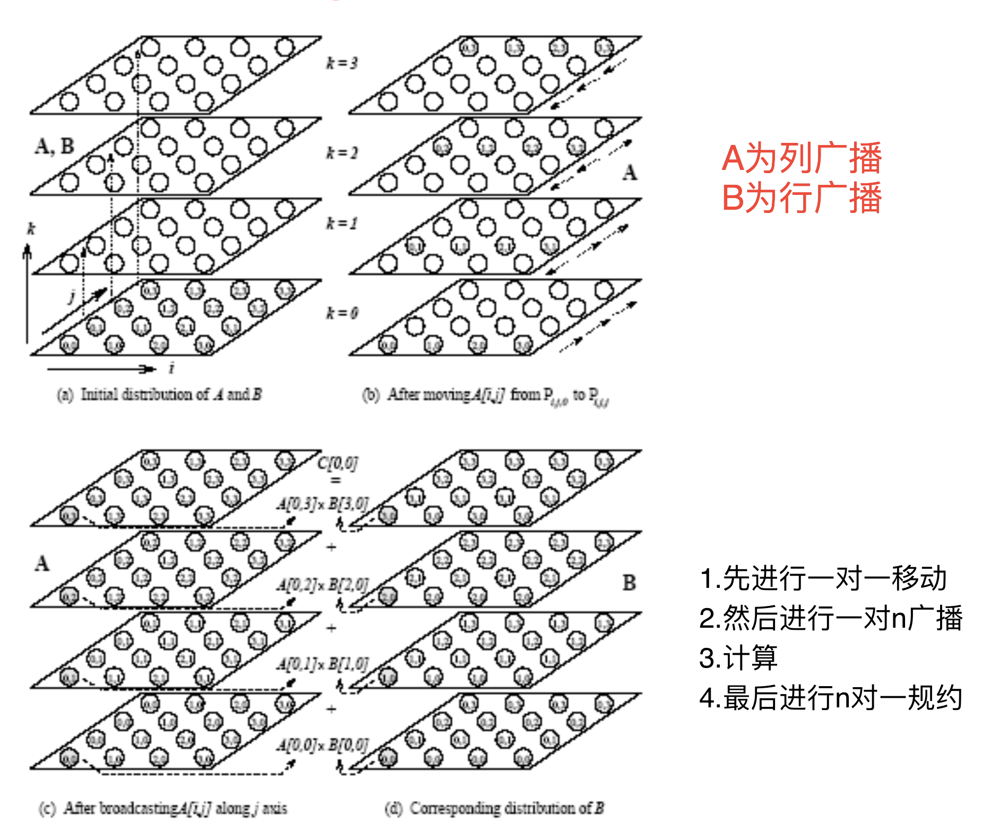

    Step1：将A矩阵的第i行移动到第i层的相应位置。（i从0开始）

    Step2：将A矩阵元素进行列广播。

    Step3：将B矩阵的第i列移动到第i层的相应位置。（i从0开始）

    Step4：将B矩阵元素进行行广播。

    Step5：每个处理器进行1对1乘法计算。

    Step6：进行n对1规约，将计算结果规约到第0层上，得到最终结果。

  - p < n^3：（每个处理器处理$n/ \sqrt[3]p*n/\sqrt[3]p$大小的数据）

    令$q = \sqrt[3]p$，则：

    第一步花费时间：$t_s + t_w (n / q)^2$

    第二步花费时间：$t_s \log q + t_w (n / q)^2 \log q$

    第三步花费时间：$t_s + t_w (n / q)^2$

    第四步花费时间：$t_s \log q + t_w (n / q)^2 \log q$

    第五步花费时间：$(n / q)^3$

    第六步花费时间：$t_s \log q + t_w (n / q)^2 \log q$

    并行运算时间：

    $T ≈ (n / q)^3 +  3t_s \log q +3 t_w (n / q)^2 \log q = n^3 / p + t_s \log p + t_w (n^2 / p^{3/2}) \log p$，当$p = O((n/ \log n)^3)$时，成本最优。

    等效率函数：$W = \Theta(p(\log p)^3)$

### 8.3 线性方程组求解

（大家都是SIMD，偏偏这个东西是流水线）

看懂了但是不会描述，emmmmmm...

应该考不到的吧，就算考到了估计大部分人都不会做。

（救不了告辞等死吧.jpg）

## Chap 9 排序算法

**PS：本章中，忽略成本最优和等效率函数**

### 9.1 并行计算机中的排序问题

- 每个处理器有单个元素，进行比较：见图，通讯一次即可。

  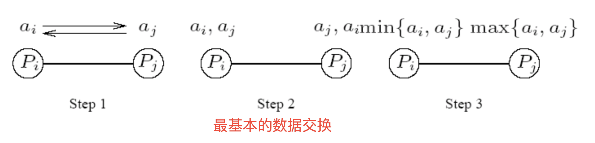

- 每个处理器有单个元素，进行比较：见图，获得所有数据后内部排序，取前半部分或者后半部分。

  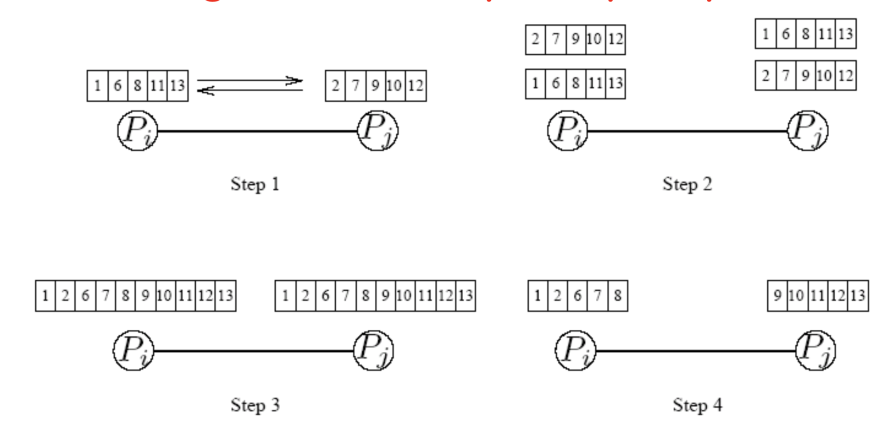

### 9.2 排序网络

- 递增比较器和递减比较器：见图，看上面是加号还是减号即可。

  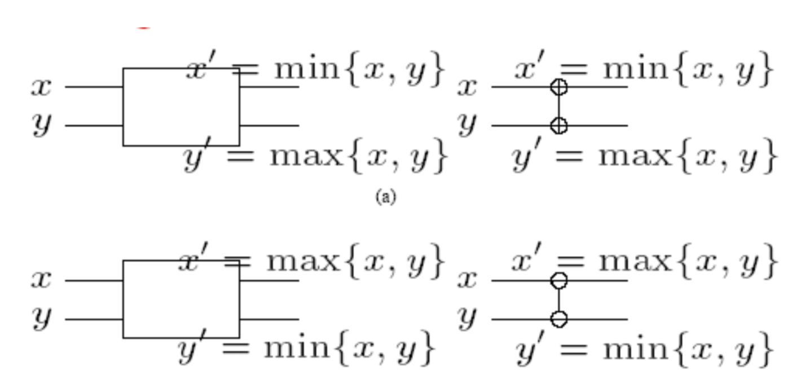

- 典型排序网络：

  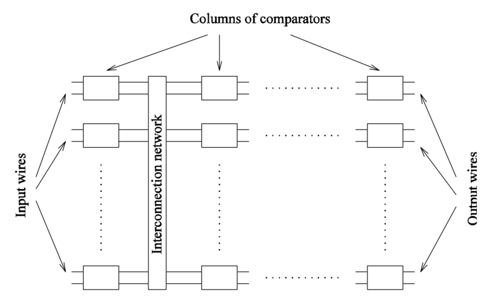

  排序网络由多个一连串的列组成，每个列包含多个并行连接的比较器。

- 双调排序：

  - 双调序列：一个序列经过移位（置换）后，符合序列前半部分递增，后半部分递减，即为双调序列。双调序列是双调排序的基础。

    例如：[1, 3, 5, 7, 6, 4, 2]是一个双调序列，[4, 2, 1, 3, 5, 7, 6]也是一个双调序列。

  - 双调分裂：假设一个双调序列S有n个元素，将这个双调序列分成两个子序列A、B，其中A[i] = min{S[i], S[i + n/2]}，B[i] = max{S[i], S[i + n/2]}，则A、B也都是双调序列。

  - 双调序列 -> 有序序列：

    - 理论递归过程：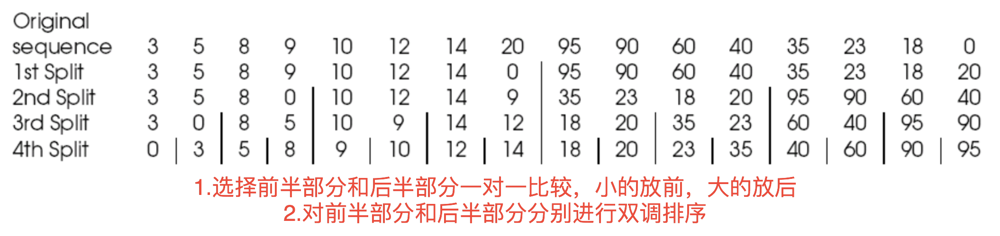

      Step1：通过双调分裂，生成两个子双调序列。

      Step2：对子双调序列同时应用双调排序。

      ...

      StepN：所有子序列长度为1，排序结束。

    - 实际过程：

      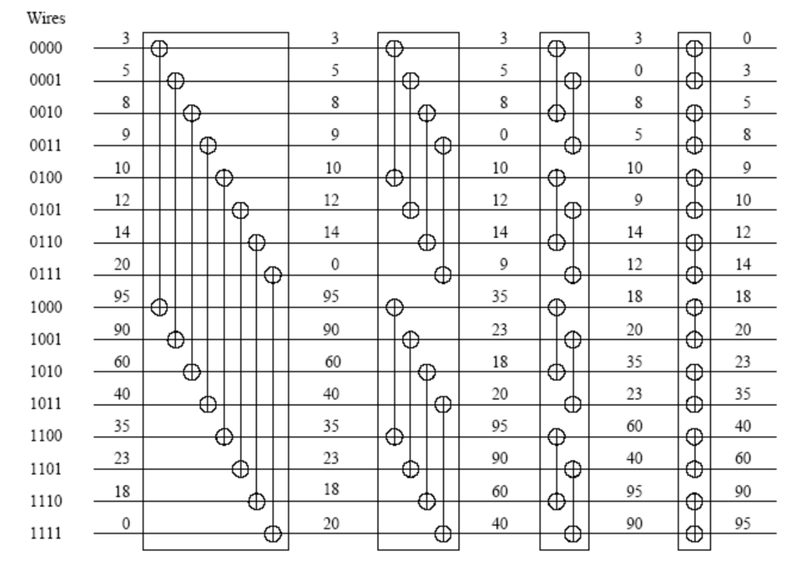

      PS：对子序列的双调排序同时进行。

      **假设对大小为n的双调序列进行排序，则需要logn步。**

  - 有序序列 -> 双调序列：

    一个大小为n的有序递增序列和一个大小为n的有序递减序列进行组合，可以生成一个大小为2n的双调序列。

  - 无序序列 -> 有序序列：

    - 理论递归过程：（类似于归并排序）

      Step1：序列可以看成多个大小为2的双调序列。

      Step2：双调序列 -> 有序序列。其中，对每个邻近的有序序列，其中一个排序顺序为递增，另一个排序顺序为递减。

      Step3：有序序列 -> 双调序列。两个有序序列可以组合成一个长度为4的双调序列。

      Step4：双调序列 -> 有序序列。其中，对每个邻近的有序序列，其中一个排序顺序为递增，另一个排序顺序为递减。

      Step5：有序序列 -> 双调序列。两个有序序列可以组合成一个长度为8的双调序列。

      ...

      StepN：双调序列 -> 有序序列。最后生成一个长度为n的有序序列。

    - 实际过程：

      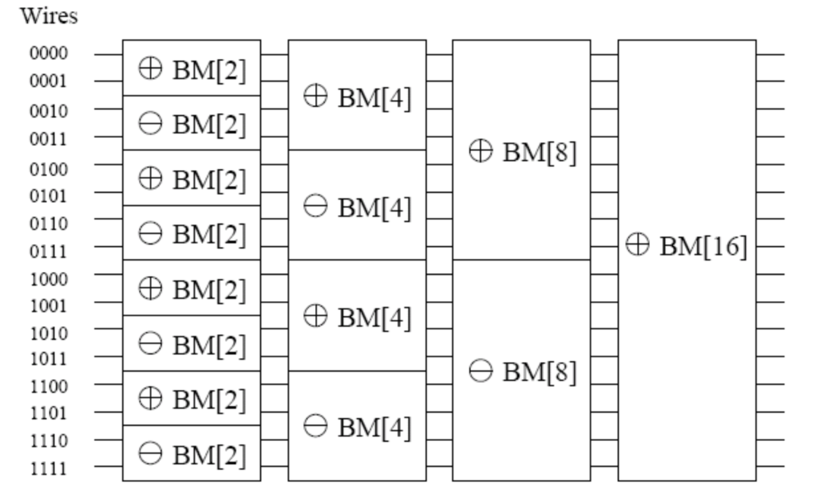

      PS：生成有序序列的过程（除最后一步）同时进行。

      假设对大小为n的无序序列进行排序，一共需要logn次双调序列 -> 有序序列的过程，则需要：

      $\log2 + \log 4 + \log 8 + ... +\log n = 1 + 2 + 3 + ... + \log n = \sum_{i = 1}^{\log n} i = \log n(\log n + 1) / 2$

      时间复杂度为：$O(\log^2 n)$

- 双调排序映射到格网和超立方体：

  - p = n：

    - 格网：

      映射顺序如下：（没看懂√n怎么来的）

      并行运算时间：$T_p = \Theta (log^2 n)(比较) + \Theta (\sqrt n) (通信)$

    - 超立方体：

      序列第i个元素映射到编号为i的处理器上。

      并行运算时间：$T_p = \Theta (\log^2 n)$

  - p < n：（每个处理器有n/p个元素）

    由于现在每个处理器有多个元素，因此，在Step1中，序列不能看成多个大小为2n/p的双调序列，需要先在内部进行排序。

    - 格网：

      并行运算时间：

      $T_p = \Theta (\frac{n}{p}\log\frac{n}{p})(算法开始前排序) + \Theta (\frac{n}{p}\log^2\frac{n}{p})(比较) + \Theta (\frac{n}{\sqrt p})(通信)$

    - 超立方体：

      并行运算时间：

      $T_p = \Theta (\frac{n}{p}\log\frac{n}{p})(算法开始前排序) + \Theta (\frac{n}{p}\log^2\frac{n}{p})(比较+通信)$

### 9.3 冒泡排序及其变体（奇偶排序）

- 奇偶排序：过程太简单了，不讲了。

  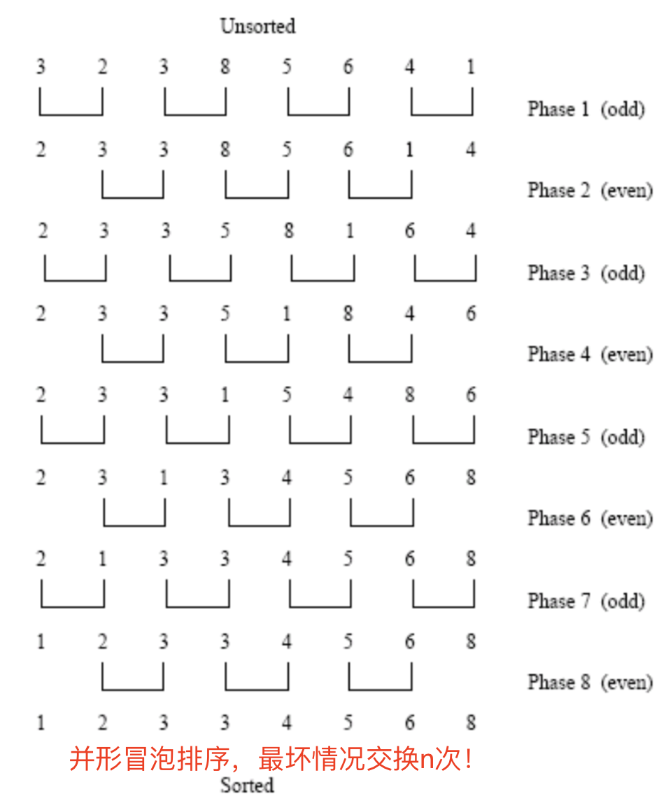

  - p = n：

    并行运算时间：$T_p = \Theta(n)$

  - p < n：（每个处理器有n/p个元素）

    同双调排序，节点在算法开始前需要在本地进行排序。

    并行运算时间：$T_p = \Theta(\frac{n}{p} \log \frac{n}{p})(算法开始前排序) + \Theta(n)(比较+通信)$

- 希尔排序：

  在奇偶排序前加上一次移位操作，l为被移动块的数量。

  - p < n：

    第一阶段（移位操作）：第0块分别与(p - 1)，(p -1)/2，(p - 1)/4…比较，共logp步。每次比较将较小的块换到前面，如果有块交换，将这两个块标记。如图：

    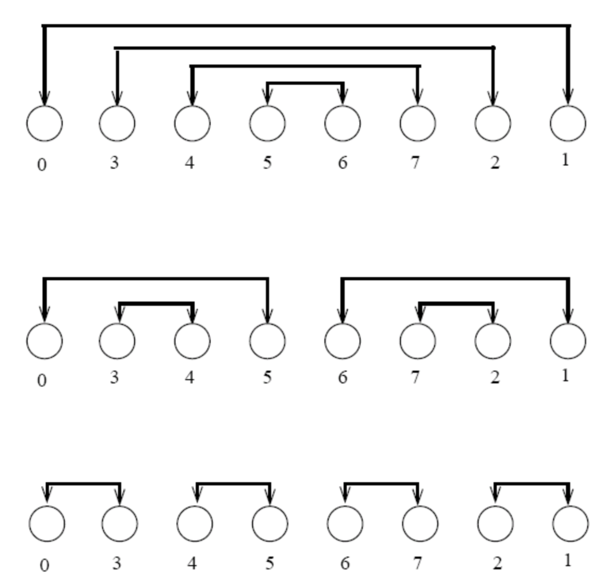

    第二阶段：普通的奇偶排序，但是只比较第一阶段中有交换的块。

    并行运算时间：$T_p = \Theta (\frac{n}{p}\log\frac{n}{p})(算法开始前排序) + \Theta (\frac{n}{p}\log p)(第一阶段) + \Theta (l\frac{n}{p})(第二阶段)$

    当l远小于p时，速度会变快，但是如果l与p相等，则复杂度和奇偶排序毫无区别。

### 9.4 快速排序

- 基于共享地址空间的并行快速排序：

  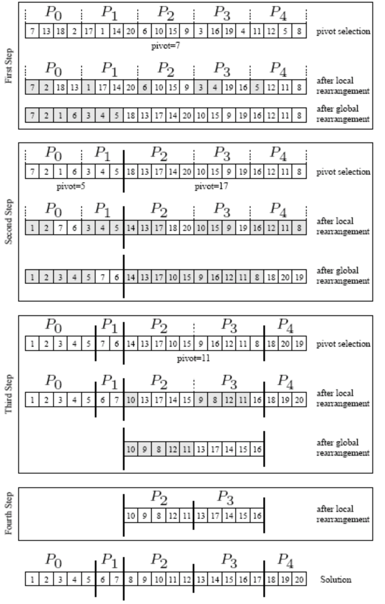

  Step1：选择一个主元(pivot)，每个处理器内部进行内部快排后，然后进行全局重排。全局重排的过程如下。

  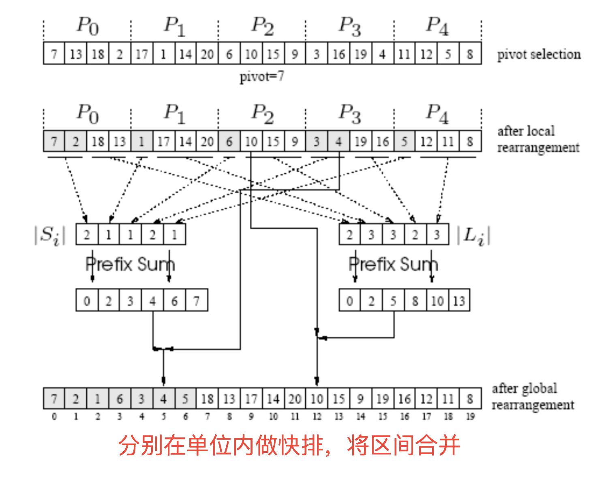

  Step2：左右子集同时进行快速排序，其中处理器根据子集数量大小分配。

  并行时间复杂度：$T_p = \Theta (\frac{n}{p}\log\frac{n}{p})(局部排序) + \Theta (\frac{n}{p}\log p)(数组分裂) + \Theta (\log^2 p)(数组分别)$

  （没看懂为什么。。）

### 9.5 桶排序（感觉不是很重要）

**PS：桶排序的前提是对分带宽必须达到O(p)，即一个处理器可以同时接收p个其他处理器的数据**

下面一步步的了解桶排序的原理：

1. 每个处理器接收一定范围内的数字，放入自己的桶里。相邻两个处理器之间的分界值叫做分裂器。

   例如：有三个处理器P0，P1，P2，排序1-24的数组，则可以P0接收1-6的数据，P1接收7-19的数据，P3接收20-24的数据，不在范围内的数据不接收，这样，就可以并行桶排。分裂器为6，19。（数组可以不等分）

2. 现在，每个处理器能预先获得数组的一部分数据，并且将不属于自己范围内的数据广播。

   接上：假设数组前6个值为[1, 2, 10, 12, 22, 24]，P0会广播10，12，22，24。

3. 当数据未知时，需要通过样本组合确定处理器间的全局分裂器。

   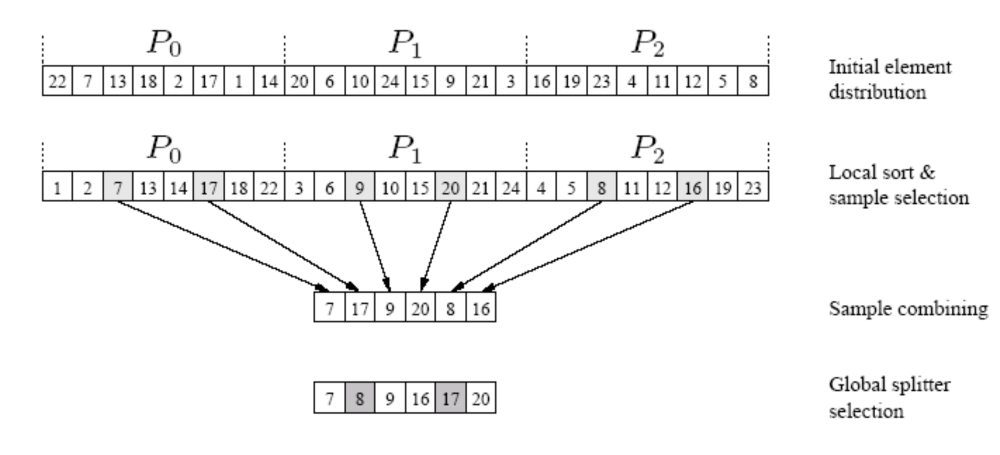

   Step1：每个进程内部划分局部分裂器。

   Step2：将内部划分的分裂器整合成一个数组，并且排序。

   Step3：在整合后的数组内划分分裂器，此分裂器即为全局分裂器。

   得到分裂器后，通过1，2，就可以进行并行桶排序了。

## Chap 10 图算法

**PS：本章中，忽略成本最优和等效率函数**

**PS2：本章基础是要先了解对应的图论知识和串行算法知识**

### 10.2 最小生成树：Prim算法

- 每个处理器拥有的资源如下：

  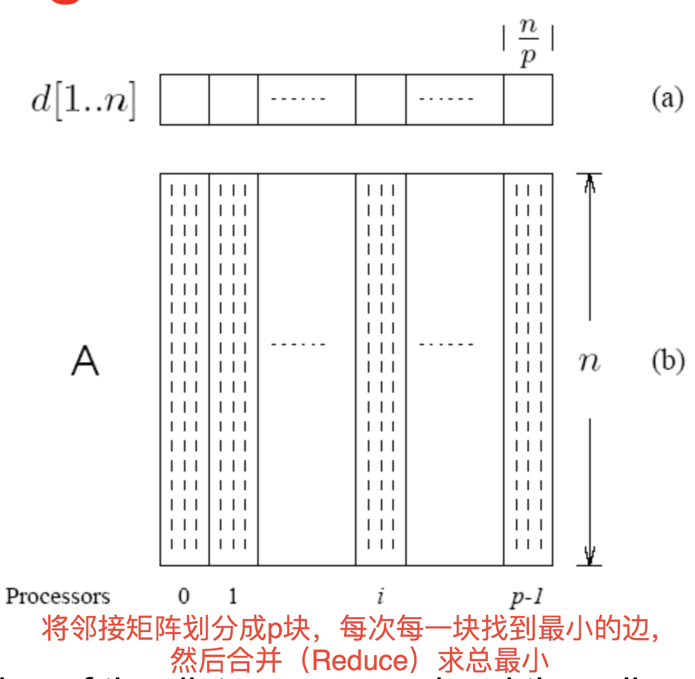

  - 权值数组d的其中一部分。
  - 邻接矩阵A的其中一部分，按列划分，因此只知道对应节点的入边权值。

- 迭代过程：（从找到其中一个最小节点i开始，到找到下一个最小节点j结束）

  Step1：找到一个最小节点i，对应处理器更新数组d[i]。

  Step2：该处理器一对多广播d[i]。

  Step3：所有处理器根据d[i]，更新数组d中属于自己的部分，并且记录其中最小值。

  Step4：进行多对一规约，得到最小的权值d[j]，则下一个节点是j。

  第一步花费时间：$1$

  第二步花费时间：$\log p$

  第三步花费时间：$\frac{n}{p}$

  第四步花费时间：$\log p$

  由于要执行n次，因此并行计算时间为：$T_p = \Theta(\frac{n^2}{p})(计算) + \Theta(n\log p)(通讯)$

### 10.3 单源最短路径：Dijkstra算法

- 同Prim，不讲了。

###10.4 全部顶点之间的最短路径 

- 以矩阵相乘为基础的算法：

  $A -> A^2 -> A^4 ->... -> A^n$

  共logn次矩阵相乘，每次相乘复杂度为logn（DNS）。

  并行计算时间：$T_p = \Theta(\log^2 n)$

- 其他没看懂，不讲了。

### 10.6 连通分量

- 并行DFS/BFS：

  初始时，每个处理器拥有n/p x n个数据。步骤如下：

  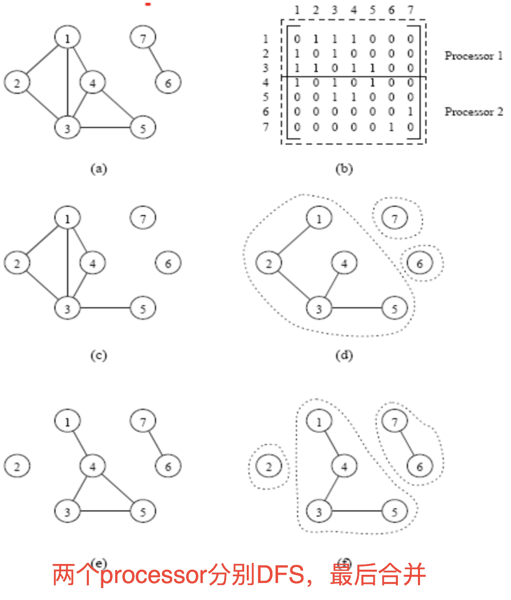

  （PS：上图中，c是P1得到的图（邻接矩阵），d是P1生成的可连通块；e是P2得到的图（邻接矩阵），f是P2生成的可连通块）

  Step1：每个处理器内部进行DFS/BFS，得到局部可连通图。

  Step2：将局部可连通图合并成整个图，得到全局可连通图。

  第一步花费时间：$\Theta(n^2 / p)$

  第二步花费时间：$\Theta(n \log p)$（不知道怎么来的，我猜是每个节点多对一规约一次）

  并行计算时间：$T_p= \Theta(n^2 / p)(局部计算) + \Theta(n \log p)(合并)$

### 10.7 稀疏图算法

- 查找最大独立集（Ludy算法）：

  设立两个点集合V1，V2，初始时，V1为空，V2 = V。

  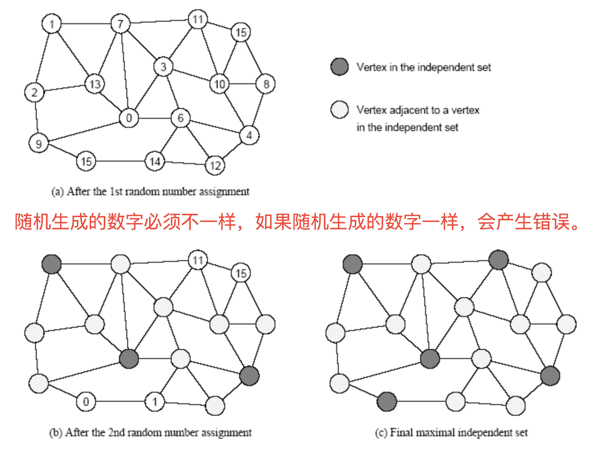

  在每一步中，更新步骤如下：

  Step1：V2中所有节点设置随机值。

  Step2：每个处理器判断自己的节点的值是否是邻居中最小的，如果是该节点加入V1，V2移除该节点和它的所有邻居节点。

  重复上述两个步骤直到V2为空，此时V1是最大独立集

  

