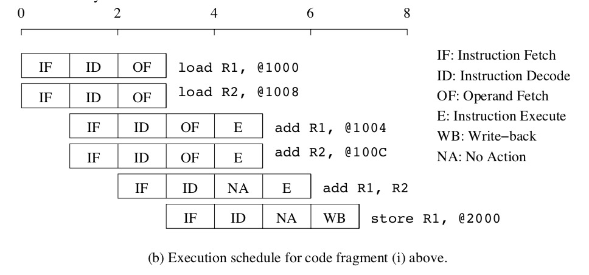
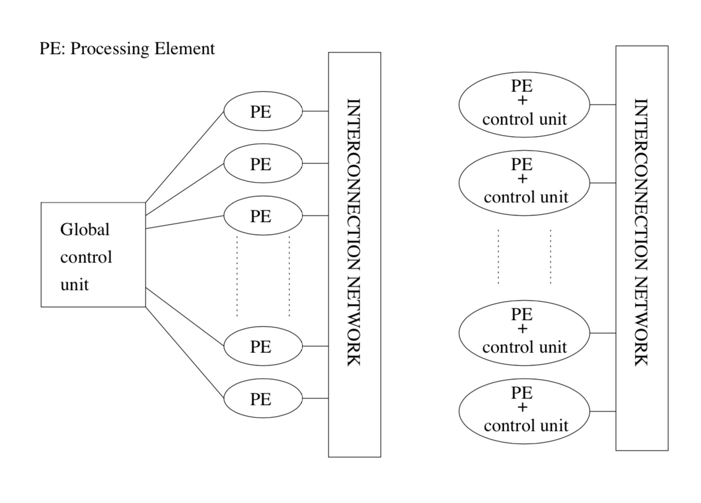
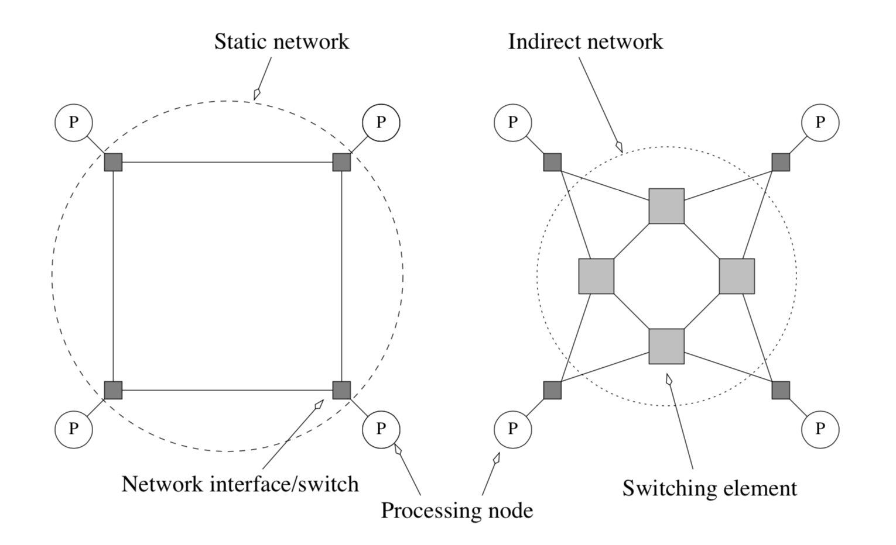
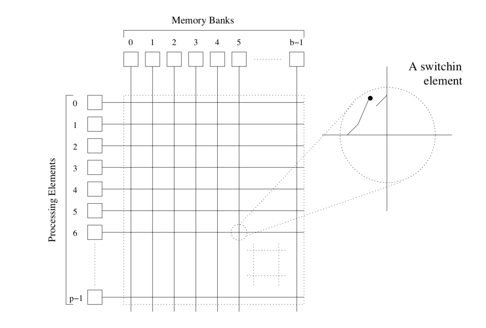
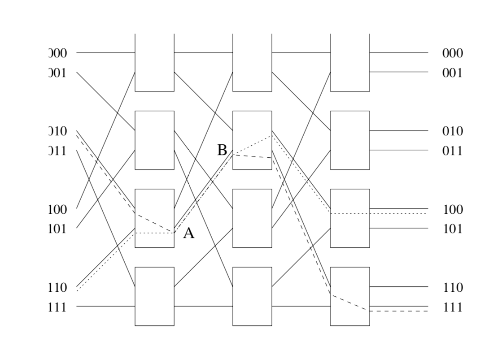
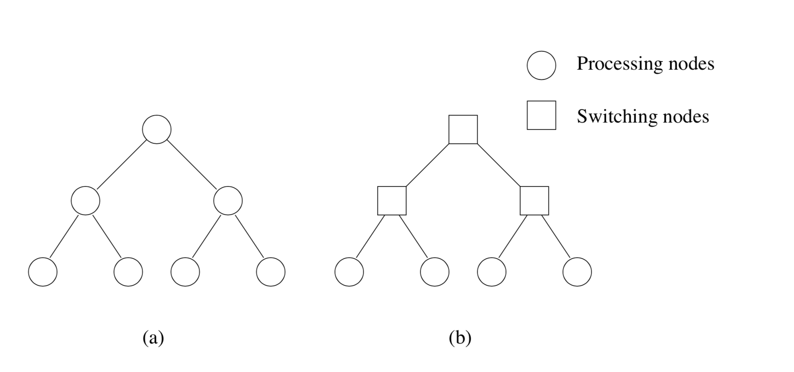
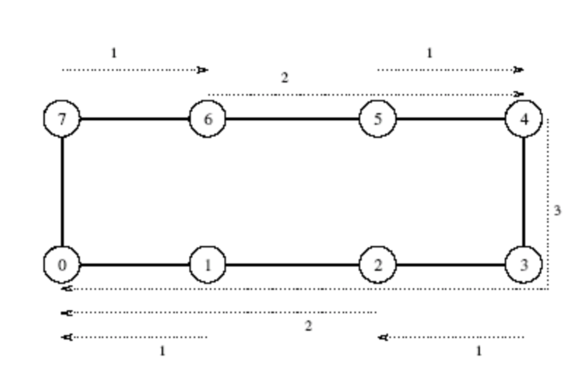
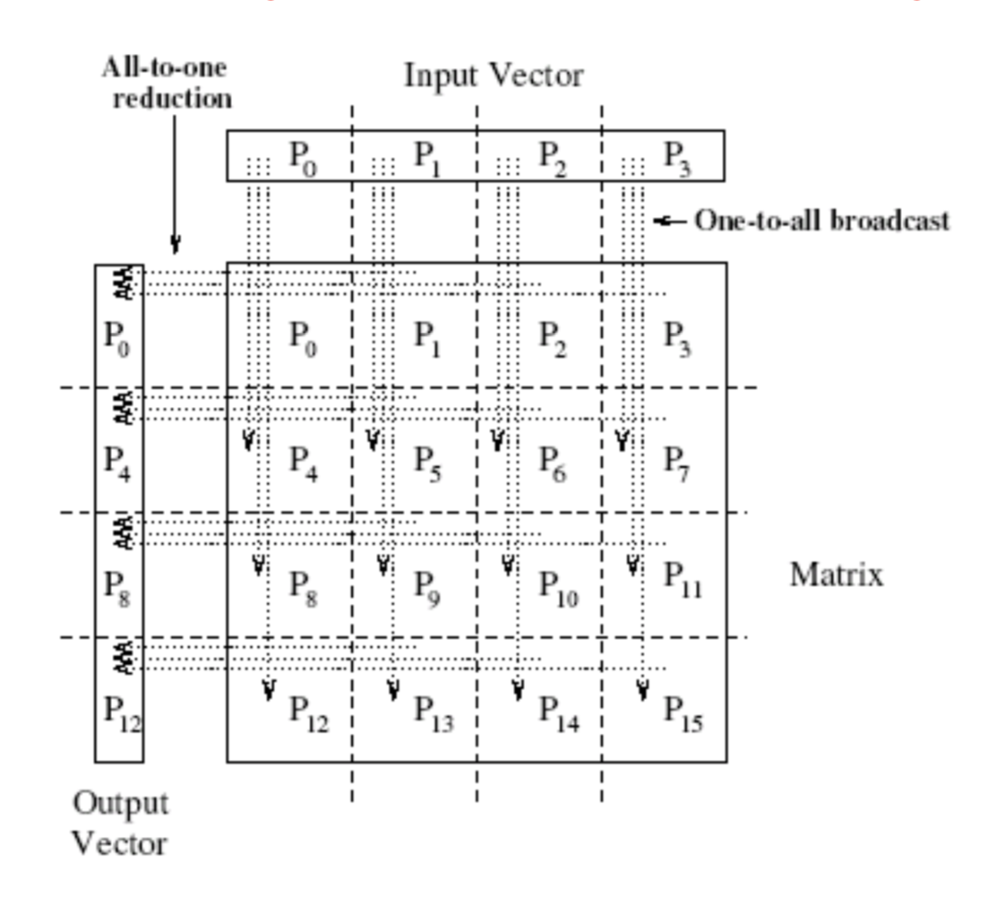
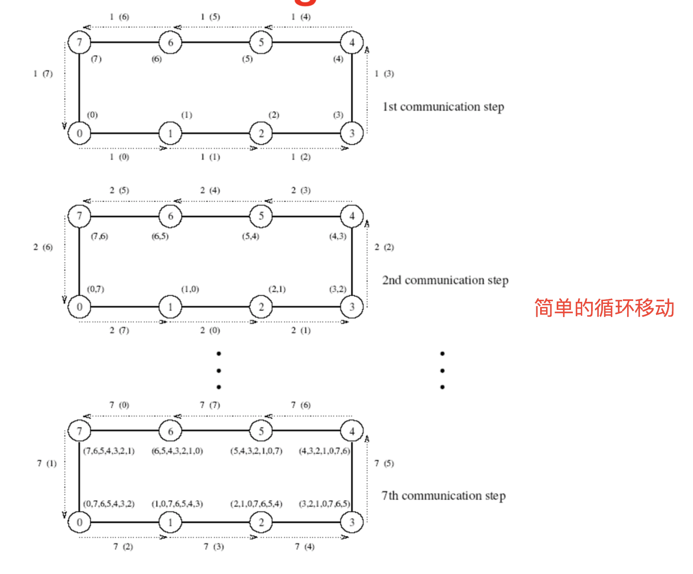

# 分布式系统复习大纲

> Author：胡子昂  
>
> Date：2018年6月4日 星期一 下午7:06

## Chap 2 并行编程平台

### 2.1

- 微处理器体系结构发展：

  1. 流水线（pipeline）：等同于操作系统流水线。

  2. 超标量执行：有多个流水线，同时执行多条相同流水线阶段的指令。

     

###2.2

- 内存局限：
  - 延迟：内存收到一条内存字请求，在lus的延迟后，返回数据。则延迟为lus。
  - 带宽：程序每秒钟通过请求内存可获得的最大字节数。
  - 躲避延迟方法：
    1. 预取：预先取更多的数据。
    2. 多线程：一个线程等待时切换到另一个线程。

### 2.3

- 并行计算平台控制结构：

  - SIMD和MIMD：

    SIMD是单指令多数据流，只有一个控制单元，该控制单元将单个指令交给不同处理器执行，**机器内部需要进行同步**。（并行算法主要研究SIMD）

    MIMD是多指令多数据流，每个处理器有一个控制单元，每个控制单元将指令交给对应的处理器执行，**机器内部不需要进行同步**。

    

- 并行计算平台通讯模型：

  - SIMD通信模型：共享地址空间平台（PRAM，即共享内存机器）和消息传递平台。

    共享内存一般用于单一计算机内通讯。

    消息传递一般用于计算机之间通过网络通讯。

### 2.4

- 并行平台物理组织：

  - PRAM的四小类：
    1. EREW：串行读，串行写。
    2. CREW：并行读，串行写。
    3. ERCW：串行读，并行写。
    4. CRCW：并行读，并行写。
  - CRCW（仅限于CW）的四种协议：
    1. 共有：如果处理器写的值相同，则写入。
    2. 任意：当一个处理器写时，其他不能写。（等同于EW）
    3. 优先级：处理器按优先级排序，最高优先级的写，其他不能写。（有优先的EW）
    4. 求和：所有量的总和被写入。类似于O(1)的规约。

- 网络拓扑结构：

  1. 基于总线：所有处理器通过总线进行通讯和访问内存。

     

  2. 交叉开关网络：n个处理器和m个内存存储地址，用一个n*m矩阵S访问。例如：当S\[i\]\[j\]打开时，代表第i个处理器正在访问第j个内存储存地址。

     

  3. 多级网络：多级网络的每个节点开和关代表两种连接，一种是直通式(a)，一种是跨接式(b)。

     

     多级网络的一种连接例子：omega网络。

     

     通过切换每个节点的开关，可以将左边8个节点（代表处理器）通过不同方式映射到右边八个节点上（内存）。

     Q：如何通过控制开关将左边节点映射到右边节点？例如如何控制节点将S(010)映射到T(111)。

     A：先求出s⊕t = 101，1代表交叉，0代表平行。因此s->t途径的三个节点分别是交叉平行交叉(101)。

  4. 全连接网络和星型网络：太简单了，略。

  5. 线性网络：连一条线，分为有环和无环。

  6. 2维格网：2维线性网络，分为有环和无环。

  7. k-d格网：有d维，每一维有k个节点。其中，个数为p的线性网络是1-p格网或者p-1格网。

  8. 超立方体：看图，和计算机类似的一种多级网络。

     

  9. 树网络：同数据结构的树，可分为静态树，动态树，胖树。

     静态树：非叶节点是处理器。

     动态树：非叶节点是开关节点。

     

     胖树：在动态树的基础上，树层级越高边数越高。

     

- 静态互联网络评价：

  - 评价参数：

    - 直径：网络任意两个节点之前的最长距离。
    - 弧连通性：等同于找出网络中任意一个节点，该节点的边数量最小，这个值就是连通性值。
    - 对分宽度：如果要将网络等分，最少需要切多少条边。
    - 成本：网络中总共有多少条边。

  - 评价图：

    

- 动态互联网络评价：

  - 评价参数：除成本都一样。

    - 成本：网络中总共有多少个开关。

  - 评价图：

    

### 2.5

- 并行计算机的消息传递成本：

  - 评价参数：

    - 启动时间$t_s$：发送节点和接受节点处理消息所花的时间，一条消息只有一次。
    - 每站时间$t_h$：消息在节点之间传输时间。（**非常小，基本没用过**）
    - 每字传输时间$t_w$：节点接收一个字节所花的时间。

  - 存储转发（store-forward）时间：（l条链路边，数据大小为m）

    $t_{comm} = t_s + mlt_w$

    （PS：$t_h$忽略。）

  - 直通路由（cut-through）时间：（l条链路边，数据大小为m）

    $t_{comm} = t_s + lt_h + mt_w 或者 t_{comm}=  t_s + mt_w$

    （PS：$t_h$可以忽略。）

## Chap 3 并行算法设计原则（感觉没什么重要的）

### 3.1

- 分解：把一个计算分解成多个小部分，其中的一些或全部部分可以并行执行。
- 任务：程序员定义的计算单元，分解出的每一部分都可称为一个任务。
- 映射：将其中一个任务映射到其中一个进程上执行。

### 3.2

- 递归分解：将问题划分成子问题，子问题划分成更小的子问题。（例如：归并排序分解）
- 数据分解：将要处理数据划分成多个部分。其中包括：
  - 划分输入数据。
  - 划分输出数据。
  - 同时划分输入和输出数据。
  - 划分中间结果数据。

## Chap 4 基本通讯操作

**PS：基本通讯操作一般都是建立在cut-through上。store-forward则只用看直径即可。**

**PS2：有一种简单的判断T的方法。ts前面的参数是总共进行的步数，tw前面的参数是0节点（首节点）在这个过程中传输的数据量总和**

**例如：对一对多广播环形陈列，假设有p个处理器，则步数为logp，首节点每步传输的数据固定为m，总共有logp次，则时间为：T = ts logp + tw m logp**

### 4.1 一对多广播和多对一规约

**PS：多对一规约就是一对多广播的逆方向**

**PS2：每一步需要的时间见2.5**

- 环形或线性陈列：假设有p个处理器，对收到数据的节点i，分别向i + p/2，i + p/4，i + p/8…传递数据直到所有数据传输完毕。总共需要logp步。

  广播和规约如下图：

  

  

- 矩阵和向量乘法：n*n矩阵S和n\*1向量V的乘法，假设有n\*n个处理器。

  Step1：n个处理器将向量中的每个元素广播到矩阵中的相应列中，例如将V[i]广播到S的第i列中。

  Step2：每个处理器负责一个节点，进程乘法计算。

  Step3：每行的n个处理器进行规约，规约到一个处理器中，得到n*1结果向量。

  

- 格网：横着来一次线性广播，接着竖着来一次线性广播。假设有p个处理器，则总共需要2log√p步，即logp步。

- 超立方体：看作n维格网，由于每增加一维增加相同节点数，因此每传递一维需要一步。假设有p个处理器，则总共需要logp步，即维数。

- 平衡二叉树：做法等同于线性陈列广播。

- 总结：无论哪种情况，广播和规约的时间都为：$T = t_s\log p + t_wm\log p$

###4.2 多对多广播和规约 

**PS：多对多规约与其说是多对多广播的逆方向，不如说是在多对多广播传输数据的基础上，加上数据处理（求和之类的）**

- 环形或线性陈列：假设有p个处理器。

  Step1：将自己的数据传输给下一个节点。

  Step2 -> (p-1)：收到上个节点传递过来的数据后，储存该数据，同时把该数据传输给下一个节点。

  通过p-1步后，每个节点都有所有的数据了。

  由于每次只需要传输m大小的数据，因此所花时间为：$T = t_s(p - 1) + t_wm (p - 1)$

  

- 格网：横着来一次线性广播，接着竖着来一次线性广播。假设有p个处理器，则总共需要2(√p - 1)步。

  第一次广播传输的数据量为m，通信时间为$T_1 = (t_s + t_wm) (\sqrt p - 1)$。

  第二次广播传输的数据量为√pm，通信时间为$T_2 = (t_s + t_w\sqrt pm) (\sqrt p - 1)$。

  两个时间加到一起，总时间为：$T = T_1 + T_2 = 2t_s(\sqrt p - 1) + t_wm(p - 1)$

- 超立方体：与一对多广播相同，区别是每次节点发送的数据加倍。假设有p个处理器，则总共需要logp步，即维数。

  在第i步中，交换信息的长度为$2^{i - 1}m$，花费的时间为$t_s + 2 ^{i - 1}mt_w$。

  将所有时间相加（等比数列求和），总时间为：$T = t_s \log p + t_wm(p - 1)$

  **三者tw相同（废话），ts根据通讯结构不同。**

### 4.3 前缀和（感觉没什么重要的）

- 每个节点求前缀和的时候，根据自己的节点数选择是否加接收到的数据。

  例如：当节点3(011)在计算前缀和的时候，加第一次(2)和第二次(0 + 1)接收到的数据，最后加上自己即可。

### 4.4 散发和收集

**PS：散发发送不同的数据，广播发送相同的数据。**

散发方法类似于一对多广播，区别是每次发送的数据不同（减半）

总共时间（三种结构相同）：$T = t_s \log p + t_wm(p - 1)$

### 4.5 多对多私自通讯

**PS：每个节点都同时进行散发**

- 环形或线形陈列：假设有p个处理器。

  Step1：将自己想发送给其他人的数据(p-1个)传输给下一个节点。

  Step2 -> (p-1)：收到上个节点传输的数据集合后，取出属于自己的数据，同时把剩下的数据传输给下一个节点。

  通过p-1步后，每个节点都有所有的数据了。

  由于每步需要传输的数据从(p-1)m依次减m直到0，因此所花时间为：$T = t_s (p -1) + t_w m \frac{p(p - 1)}{2}$

- 网格：横着来一次线性广播，接着竖着来一次线性广播。假设有p个处理器，则总共需要2(√p - 1)步。

  第一次广播传输的数据量从(p - √p)m依次减√pm直到0，因此所花时间为：

- 

